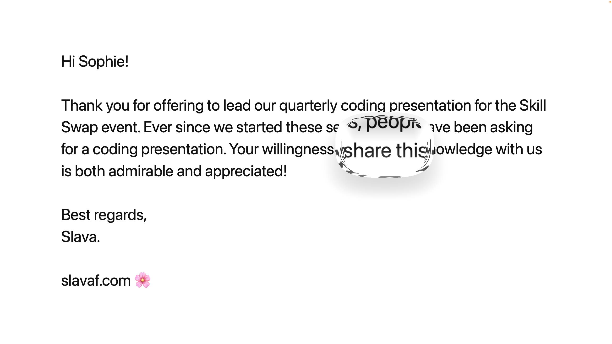

# Liquid Glass Magnifier — WebGL Refraction & Squircle Shape

Inspired by Apple-style glass UI elements introduced at WWDC25.

[Live Demo](https://hi-slava.github.io/liquid-glass/)

A smooth, dynamic "liquid glass" magnifier effect implemented with WebGL and HTML5 Canvas.
This demo features:

- **Draggable glass piece** that magnifies underlying text rendered on a separate canvas.
- **Squircle-shaped magnifying glass** with fixed 3:2 aspect ratio, sized relative to text lines.
- **Real-time refraction distortion** with smooth radial bending inside the glass area.
- **Velocity-based stretch and squish animation**: the glass shape subtly morphs depending on drag speed and direction.
- **Inner shadow and rim highlights** to create depth and glossiness for a polished look.

---

## Demo

_Try dragging the glass over the text and notice how the distortion and shape respond fluidly!_

---

## How It Works

- Text is drawn on a 2D canvas and uploaded as a texture to WebGL.
- The WebGL fragment shader calculates a squircle-shaped area for the magnifier.
- Inside this area, UV coordinates are radially displaced with a bending factor to simulate refraction.
- The glass shape stretches dynamically based on drag velocity for an organic feel.
- Lighting effects are added in the shader to simulate inner and outer shadows and rim highlights.

---

## Usage

- Simply open index.html in your browser and drag the glass around.
- Or check the demo here: <https://hi-slava.github.io/liquid-glass/>.
- If the text looks too small, try increasing your browser window size.
- Tested on latest Safari and Chrome.

---

Created by Slava Filimonov — slavaf.com
